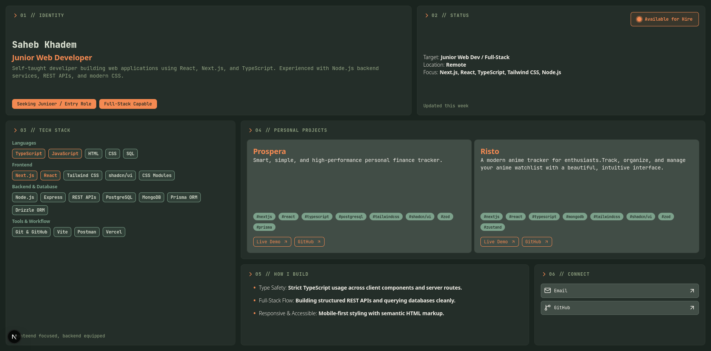

<div align="center">

# Saheb Khadem — Portfolio

### A single-page, bento-grid developer portfolio built with Next.js



<br />

[](https://nextjs.org/)
[](https://react.dev/)
[](https://www.typescriptlang.org/)
[](https://tailwindcss.com/)
[](https://ui.shadcn.com/)
[](https://biomejs.dev/)
[](https://vercel.com/)

**[Live Version](<>)**

</div>

---

## About

This is my personal portfolio site — a single-page, no-scroll (on desktop) bento-style layout that packs my identity, availability status, tech stack, projects, and contact info into one clean grid. Built from scratch with Next.js, TypeScript, and Tailwind, styled with a gruvbox-inspired theme.

## Features

- 🧩 **Bento grid layout** — modular tiles for identity, status, tech stack, projects, and contact
- 📱 **Responsive** — no-scroll fixed layout on desktop, natural vertical scroll on mobile
- 🎨 **Gruvbox theme** with dark mode
- ⚡ **Fully typed** with strict TypeScript across components and utilities
- 🧱 **shadcn/ui** components built on top of Radix/Base UI primitives
- 🧹 **Biome** for linting and formatting

## Tech Stack

| Category       | Stack                   |
| -------------- | ----------------------- |
| **Framework**  | Next.js, React          |
| **Language**   | TypeScript              |
| **Styling**    | Tailwind CSS, shadcn/ui |
| **Icons**      | Lucide                  |
| **Tooling**    | Biome                   |
| **Deployment** | Vercel                  |

## Project Structure

```
src/
  app/
    layout.tsx          # root layout, fonts, metadata
    page.tsx             # assembles the bento grid
    globals.css
  components/
    tiles/
      IdentityTile.tsx        # 01 // IDENTITY
      StatusTile.tsx          # 02 // STATUS
      tech-stack/              # 03 // TECH STACK
      projects/                 # 04 // PERSONAL PROJECTS
      HowIBuildTile.tsx        # 05 // HOW I BUILD
      ConnectTile.tsx           # 06 // CONNECT
    ui/                    # shadcn/ui primitives (card, badge)
  lib/
    projects.ts            # project data
    utils.ts
```

## Contact

- **Email** — saheb1379@gmail.com
- **GitHub** — [@sahebkhadem](https://github.com/sahebkhadem)

---

<div align="center">
<sub>Built with ☕ and way too many hours in the terminal.</sub>
</div>
